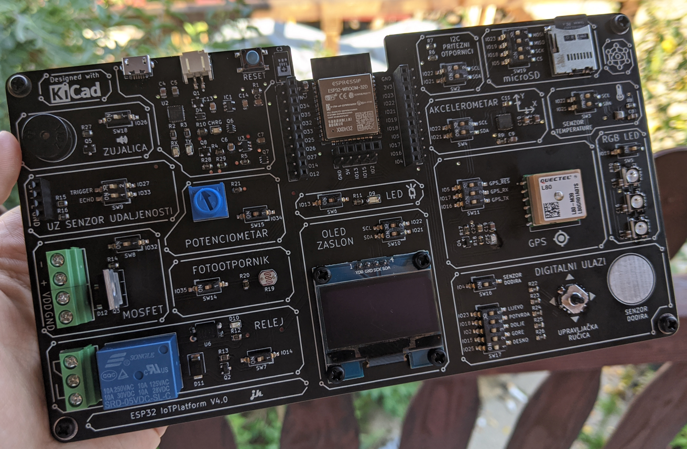

# ESP32IoTPlatform
Note: To fix the current KiCad 6.0 issues regarding 3D component models, add the missing KISYS3DMOD to point to the same location as KICAD6_3DMODEL_DIR

Educational IoT platform based on ESP32 microcontroller

ESP32IoTPlatform is an open source platform aimed towards students at Zagreb University of Applied Sciences who will take an IoT course.

